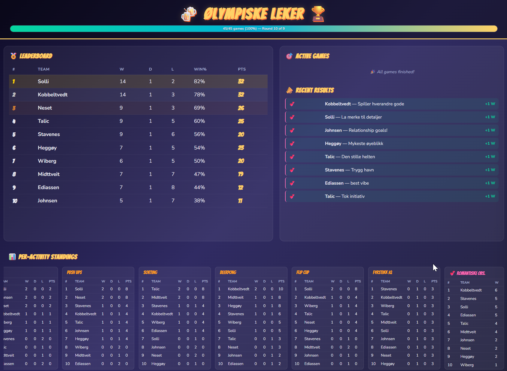
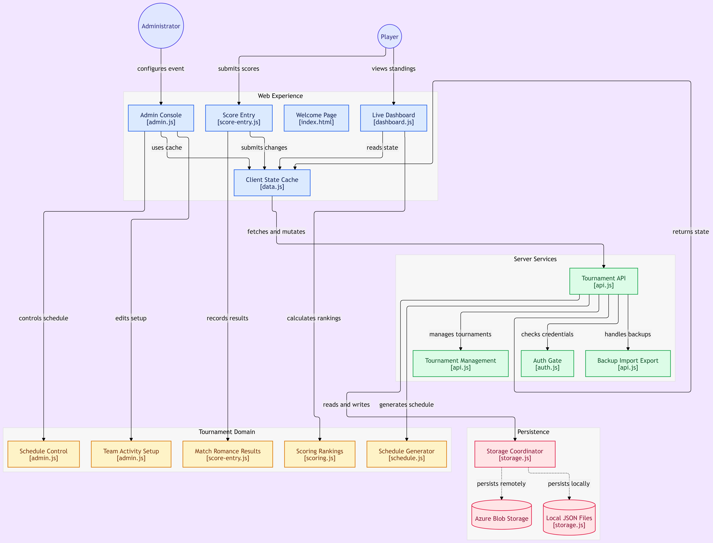

# 🏅 Ølympiske Leker
### Det ultimate turneringssystemet 💕

**🌐 Live:** [https://oelympiske-leker-sdtui.azurewebsites.net](https://oelympiske-leker-sdtui.azurewebsites.net)

Et komplett system for å holde styr på konkurranser, seire, romantiske øyeblikk og drama. Bygget med ren HTML, CSS og vanilla JavaScript i front—ingen rammeverk, bare ren kjærlighet—pluss en liten Node/Express-server i bunn.

Laget for eget bruk (med stor suksé), for par-tur. Nå live på Azure, så alle kan registrere poeng fra mobilen sin. 📱



## 🎯 Hva er dette?

Er du lei av å miste oversikten når dere holder ølympiske leker? dette systemet holder styr på alt! Lag, resultater, poengtavler, og ja — til og med de romantiske observasjonene som oppstår når kvelden er på sitt beste. Alt oppdateres i sanntid på tvers av alle sidene.

## 📄 Sidene

### 🏠 **index.html** — Forsiden
En enkel velkomstside med navigasjon til alle funksjonene.

### 📊 **dashboard.html** — Live Dashboard
Her skjer det! Sanntids poengtavle, fremdriftssporing, pågående kamper, nylige resultater, per-aktivitet resultater og en rullende ticker. Alt oppdateres automatisk—på tvers av alle mobiler og skjermer—uten refresh. Pluss fanfare-overlay når nye resultater tikker inn. 🎺

### ⚙️ **admin.html** — Administratorpanelet
Her administrerer du hele turneringen gjennom flere under-faner:
- **🏅 Teams** — Legg til, gi nytt navn til, og fjern lag
- **🎯 Activities** — Konfigurer poengregler, vekting og spilltyper
- **🎪 Pre-Tournament** — Registrer resultater fra før turneringen starter (for seeding, eller felles aktiviteter)
- **💕 Romantiske** — Hold oversikt over romantiske observasjoner (+1 seier hver)
- **📋 Schedule** — Generer round-robin kampoppsett med smart aktivitetsfordeling
- **�️ Tournaments** — Opprett, bytt mellom og slett turneringer (én aktiv om gangen)
- **💾 Data** — Eksporter/importer turneringsdata som JSON


### 🏆 **score.html** — Poengregistrering & Romantikk
En side med to ulike visninger som du kan bytte mellom:
- **Enter Scores** — Registrer kampresultater med numeriske verdier eller vinn/tap
- **💕 Romantiske Observasjoner** — Legg til romantiske observasjoner direkte
- Angre-funksjon for siste poengregistrering
- Sanntidssynkronisering med dashboardet

**I praksis anbefaler jeg at man lager fysiske lapper som man gir til andre lag**
Deretter når man som team har mottatt en lapp, legger man den inn på nettsiden💕

## 🎮 Kjernefunksjoner

### Sortering av Poengtavlen
Lagene rangeres etter **(seire - tap)** først, deretter totale poeng som tiebreaker. Med andre ord—konsistent god prestasjon slår flashy poengfangster.

### Romantiske Observasjoner
Hver observasjon gir **+1 seier** (ingen poeng). Fordi kjærlighet alltid vinner, duuuuh.

### Smart Kampoppsett
Round-robin generator med greedy aktivitetsfordeling sikrer at hvert lag spiller hver aktivitet omtrent likt. Aktivitetsvekter kontrollerer frekvens (0.5 = halvparten så ofte, osv.).

### Synkronisering Mellom Enheter
Redigerer du noe i admin, eller noen legger inn poeng fra mobilen sin, ser du oppdateringen på dashboardet i løpet av sekunder. Ingen refresh nødvendig. Alt går via serveren, og to lag som sender inn poeng samtidig kan aldri overskrive hverandre.
Lowkey en godsend btw

### PIN-beskyttelse 🔐
Privat arrangement = felles PIN for deltakere + egen admin-kode. Skrives inn én gang per mobil, så husker den det.

### Nylige Resultater
En samlet tidslinje som viser de 8 nyeste resultatene av ALLE typer—kamper, romantiske observasjoner, pre-tournament aktiviteter—alt kronologisk sortert.

## 🎨 Teknisk Stack

- **HTML5** — Semantisk struktur
- **CSS3** — Gradient bakgrunner, flexbox layouts, responsivt design
- **Vanilla JS** — Ingen rammeverk i frontend, bare ren JavaScript-kjærlighet
- **Node.js + Express** — Liten server som serverer sidene og et JSON-API
- **Azure App Service + Blob Storage** — Hosting og datalagring i skyen
- **GitHub Actions** — Push til main = automatisk deploy

- ~~Planlegger selvfølgelig å oppgradere løsningen til noe som også kan nåes fra mobiler og på internett (famous last words)~~
- Sa jeg "famous last words" om å få dette på nett? Vel. Det er på nett nå. 😎



## �️ How-to: Drift

Alle kommandoer kjøres i terminalen. Logg inn først (husk riktig tenant):

```powershell
az login --tenant <tenant-id>
```

### Skalere ned/opp for "turneringssesong"

App Service-planen koster penger så lenge den kjører på B1 — skaler ned til gratis F1 utenom sesong:

```powershell
# Ned (off-season, gratis — appen kjører fortsatt, men tregere og uten always_on)
az appservice plan update -g rg-rune-sin-sandkasse -n plan-oelympiske-leker --sku F1

# Opp (turneringssesong)
az appservice plan update -g rg-rune-sin-sandkasse -n plan-oelympiske-leker --sku B1
```

### Stoppe og starte appen

```powershell
az webapp stop  -g rg-rune-sin-sandkasse -n oelympiske-leker-sdtui
az webapp start -g rg-rune-sin-sandkasse -n oelympiske-leker-sdtui
```

Merk: å stoppe appen stopper ikke fakturering av B1-planen — skaler ned til F1 for det. Dataene ligger trygt i Blob Storage uansett.

### Arkivere en aktiv turnering

Turneringer slettes aldri automatisk — alle inaktive turneringer ligger arkivert i lista. Å "arkivere" = å gjøre en annen turnering aktiv:

1. Gå til **admin.html → 🏆 Tournaments**
2. (Valgfritt) Gi turneringen et beskrivende navn med ✏️-knappen, f.eks. "Haugabaret par-tur sept 2026"
3. Skriv inn navn på neste turnering og trykk **+ Create & Open** — den nye blir aktiv, den gamle ligger igjen i lista med all data intakt

### Bytte til / laste en arkivert turnering

1. Gå til **admin.html → 🏆 Tournaments**
2. Trykk **Open** på turneringen du vil hente fram — alle mobiler og dashboardet bytter til den i løpet av sekunder

### Utvide kampoppsettet midt i turneringen

Gå til **admin.html → 📋 Schedule**, sett økt antall runder og trykk **🔄 Generate Schedule**. Ferdigspilte kamper beholder poengene sine — forutsatt at lag og aktiviteter er uendret.

## �💾 Dataadministrasjon

All data lagres som JSON i Azure Blob Storage (én blob per turnering). Kjører du lokalt uten Azure, havner alt i `.data/`-mappa i stedet—null oppsett nødvendig.

Eksporter alt som JSON for backup. Importer for å gjenopprette eller dele turneringer.

## 📱 Mobilvennlig

Fullstendig responsivt design. Deltakerne registrerer poeng rett fra mobilen—ingen app, bare nettleser og PIN.

## 🎉 Funksjoner i Detalj

- **Angre-Støtte**
- **Rediger Resultater**
- **Slett Kamper**
- **Per-Aktivitet Resultater**
- **Fremdriftssporing**
- **Kampstatus**

---

Bygget med CoPilot og 💕 for fine par-turer på Voss

**Skål da for faen** 🍻
