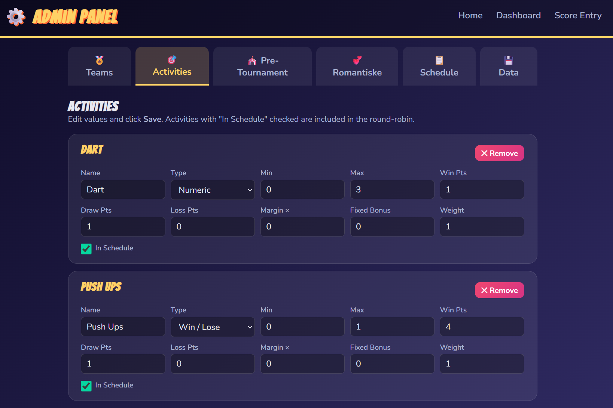

# 🏅 Ølympiske Leker
### Det ultimate turneringssystemet for beerlympics 💕

Et komplett system for å holde styr på konkurranser, seire, romantiske øyeblikk og drama. Bygget med ren HTML, CSS og vanilla JavaScript—ingen rammeverk, bare ren kjærlighet.

Laget for eget bruk (med stor suksé), for par-tur.

## 🎯 Hva er dette?

Er du lei av å miste oversikten når dere holder ølympiske leker? dette systemet holder styr på alt! Lag, resultater, poengtavler, og ja — til og med de romantiske observasjonene som oppstår når kvelden er på sitt beste. Alt oppdateres i sanntid på tvers av alle sidene.

## 📄 Sidene

### 🏠 **index.html** — Forsiden
En enkel velkomstside med navigasjon til alle funksjonene.

### 📊 **dashboard.html** — Live Dashboard
Her skjer det! Sanntids poengtavle, fremdriftssporing, pågående kamper, nylige resultater, per-aktivitet resultater og en rullende ticker. Alt oppdateres automatisk på tvers av faner via BroadcastChannel.

### ⚙️ **admin.html** — Administratorpanelet
Her administrerer du hele turneringen gjennom flere under-faner:
- **🏅 Teams** — Legg til, gi nytt navn til, og fjern lag
- **🎯 Activities** — Konfigurer poengregler, vekting og spilltyper
- **🎪 Pre-Tournament** — Registrer resultater fra før turneringen starter (for seeding, eller felles aktiviteter)
- **💕 Romantiske** — Hold oversikt over romantiske observasjoner (+1 seier hver)
- **📋 Schedule** — Generer round-robin kampoppsett med smart aktivitetsfordeling
- **💾 Data** — Eksporter/importer turneringsdata som JSON

### 🏆 **score.html** — Poengregistrering & Romantikk
En side med to ulike visninger som du kan bytte mellom:
- **Enter Scores** — Registrer kampresultater med numeriske verdier eller vinn/tap
- **💕 Romantiske Observasjoner** — Legg til romantiske observasjoner direkte
- Angre-funksjon for siste poengregistrering
- Sanntidssynkronisering med dashboardet

**I praksis anbefaler jeg at man lager fysiske lapper som man gir til andre lag**
Deretter når man som team har mottatt en lapp, legger man den inn på nettsiden💕

## 🎮 Kjernefunksjoner

### Sortering av Poengtavlen
Lagene rangeres etter **(seire - tap)** først, deretter totale poeng som tiebreaker. Med andre ord—konsistent god prestasjon slår flashy poengfangster.

### Romantiske Observasjoner
Hver observasjon gir **+1 seier** (ingen poeng). Fordi kjærlighet alltid vinner, duuuuh.

### Smart Kampoppsett
Round-robin generator med greedy aktivitetsfordeling sikrer at hvert lag spiller hver aktivitet omtrent likt. Aktivitetsvekter kontrollerer frekvens (0.5 = halvparten så ofte, osv.).

### Synkronisering Mellom Faner
Redigerer du noe i admin, ser du oppdateringen på dashboardet øyeblikkelig. Ingen refresh nødvendig. Ren localStorage-magi med BroadcastChannel + storage events + polling fallback.
Lowkey en godsend btw

### Nylige Resultater
En samlet tidslinje som viser de 8 nyeste resultatene av ALLE typer—kamper, romantiske observasjoner, pre-tournament aktiviteter—alt kronologisk sortert.

## 🎨 Teknisk Stack

- **HTML5** — Semantisk struktur
- **CSS3** — Gradient bakgrunner, flexbox layouts, responsivt design
- **Vanilla JS** — Ingen avhengigheter, bare ren JavaScript-kjærlighet
- **localStorage** — Persistent datalagring
- **BroadcastChannel** — Sanntidsoppdateringer på tvers av faner

- Planlegger selvfølgelig å oppgradere løsningen til noe som også kan nåes fra mobiler og på internett (famous last words)

## 💾 Dataadministrasjon

All data lagres i localStorage:
- `ol_teams` — Lagliste
- `ol_activities` — Spillkonfigurasjoner
- `ol_schedule` — Kampoppsett med resultater
- `ol_pre_scores` — Pre-tournament seeding
- `ol_romantic_obs` — Romantiske observasjoner
- `ol_last_action` — Angre-støtte

Eksporter alt som JSON for backup. Importer for å gjenopprette eller dele turneringer.

## 🚀 Kom i Gang

1. Åpne `index.html` i hvilken som helst moderne nettleser
2. Gå til Admin → Teams for å legge til lagene dine
3. Konfigurer Activities (eller bruk standardinnstillingene)
4. Generer Schedule
5. Bruk Score Entry til å registrere resultater
6. Se dashboardet for å følge med på æren
7. Ikke glem å legge til romantiske observasjoner 💕

## 📱 Mobilvennlig

Fullstendig responsivt design. Tilrettelagt for å kunne gjøre løsningen tilgjengelig på deltakere sine mobiler i fremtiden.

## 🎉 Funksjoner i Detalj

- **Angre-Støtte**
- **Rediger Resultater**
- **Slett Kamper**
- **Per-Aktivitet Resultater**
- **Fremdriftssporing**
- **Kampstatus**

---

Bygget med CoPilot og 💕 for fine par-turer på Voss

**Skål da for faen** 🍻
